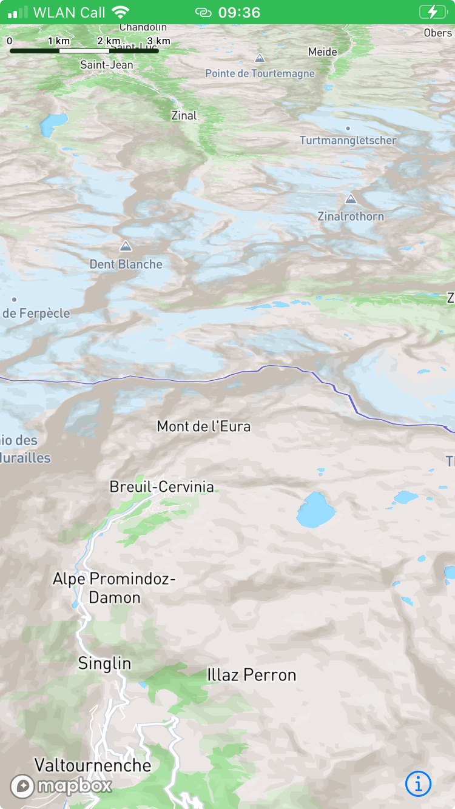

# v11 Terrain bug - minimal working example.

In the React Native wrapper around the iOS SDK, 3D terrain is not showing. v10 works fine.

## Steps to reproduce.

This repo uses expo with a native build.


1. Open your terminal or favourite IDE and run:

```bash
npx expo install
npx expo prebuild --clean
npm run start
```

2. In Xcode, open ios/TerrainMWE.xcworkspace
3. Choose your target (and signing if you want to use your device)
4. Run 'build'

Building takes time, and ends with a sim or your device loading the app. If required, choose your Expo dev server.

## Expected result

The map should show the Matterhorn, in 3D terrain.

## Result

The map is zoomed in to the Matterhorn, but no 3D terrain.

